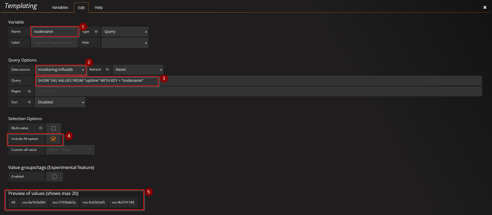
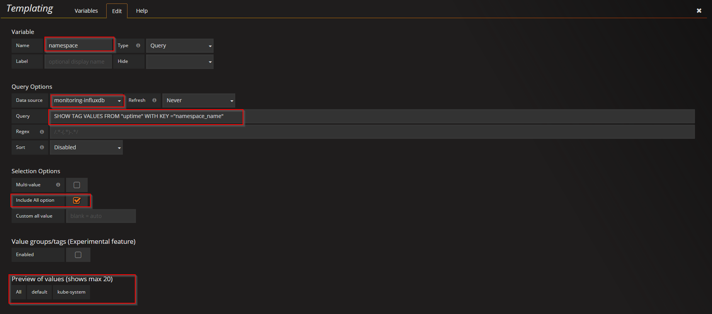
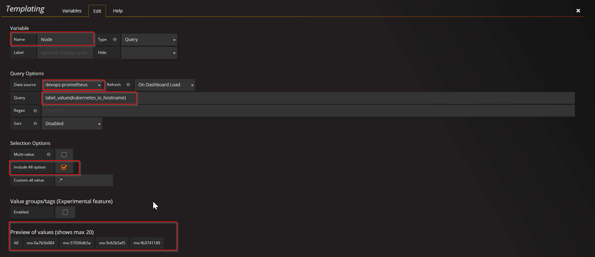

#Inlfuxdb  dashboard

-  import two dashboards used for heapster-influxdb monitoring [Pod](./heapster-influxdb-pod-dashboard.json) and [Cluster](./heapster-influxdb-cluster-dashboard.json); 
    
    **Before import them, the datasource should be modified to real influxdb datasource**
- Create templating variables for both dashboards
    1. chose `Cluster` dashboard ---> `Manage dashboard` ---> `Templating` --> `New`
    2. fill essential info as below. 
        - #1 is the name of the variable, here we chose `nodename`;
        - #2 choose influxdb datasource;
        - #3 query statment : `SHOW TAG VALUES FROM "uptime" WITH KEY = "nodename"`;
        - $4 choose `Include All option`  check box;
        - $5 will preview the result if the variable is correctly created. 

    3. chose `Pod` dashboard ---> `Manage dashboard` ---> `Templating` --> `New`
    4. fill essential info as below. 
        - #1 is the name of the variable, here we chose `namespace`, we can only use this value, this `namespace` is referenced multiple times insdie of this dashboard
        - #2 choose influxdb datasource;
        - #3 query statment : `SHOW TAG VALUES FROM "uptime" WITH KEY = "nodename"`;
        - $4 choose `Include All option`  check box;
        - $5 will preview the result if the variable is correctly created. 
    3. create second one for `Pod` dashboard. 
        - #1 is the name of the variable, here we chose `podname`
        - #2 choose influxdb datasource;
        - #3 query statment : `SHOW TAG VALUES FROM "uptime" WITH KEY = "pod_name" WHERE "namespace_name" =~ /$namespace/`; if we need reference the variable `namespace` defined ealier, we should use `/$namespace/`;
        - $4 choose `Include All option`  check box;
        - $5 will preview the result if the variable is correctly created. 

#prometheus  dashboard

 for templating for prometheus datasource
 1. to create variable `node`. 
    - #1 is the name of the variable, here we chose `node`
    - #2 choose prometheus datasource;
    - #3 query statment : `label_values(kubernetes_io_hostname)`; prometheus use label, so we use `label_vaules` to get the label value.
    - $4 choose `Include All option`  check box;
    - $5 will preview the result if the variable is correctly created. 
2. install via grafana 
  2.1 create configmap
  ```
  kubectl create configmap grafana-dashboard --from-file=