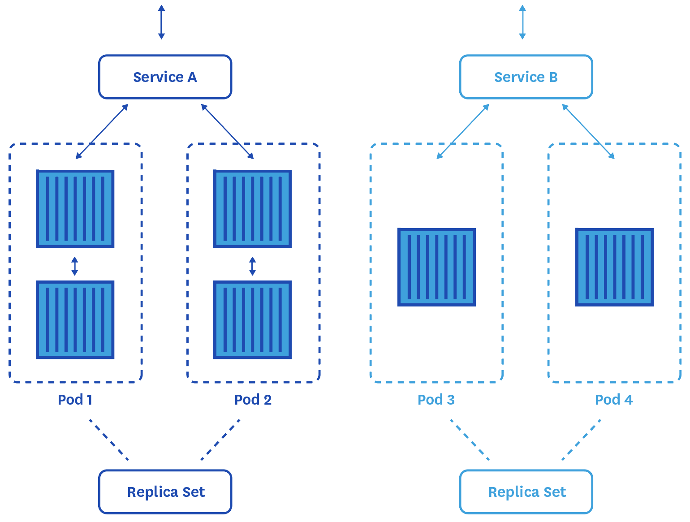
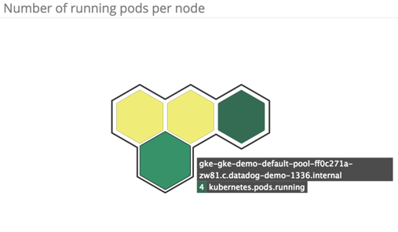
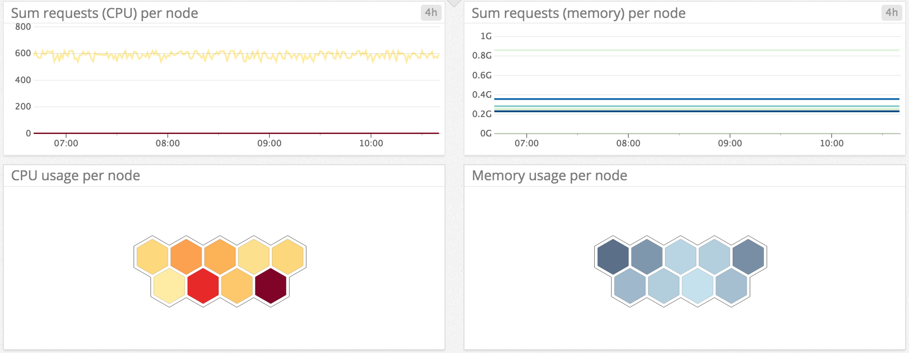
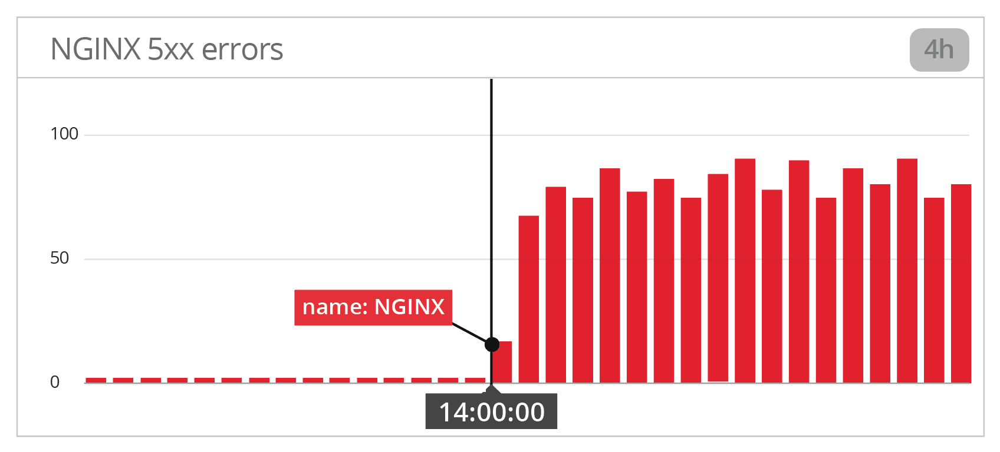

# Part 1: Monitoring in the Kubernetes era
*This post is Part 1 of a 4-part series about Kubernetes monitoring. Part 2 explores Kubernetes metrics and events you should monitor, Part 3 covers the different ways to collect that data, and Part 4 details how to monitor Kubernetes performance with Datadog.*

## What is Kubernetes?

Docker and other container technologies are currently taking the infrastructure world by storm. Ideal for microservice architectures and environments that scale rapidly or have frequent releases, [Docker has seen a rapid increase in usage](https://www.datadoghq.com/docker-adoption/#1) over the past two years. But containers introduce significant, unprecedented complexity in terms of orchestration. That’s where Kubernetes enters the scene.

### The conductor

[Kubernetes](http://kubernetes.io/) is an open source system, launched by Google, that automates the deployment, management, and scaling of containers running service-oriented applications. Many well-known partners such as Red Hat, CoreOS, VMWare, and Meteor are supporting Kubernetes development, and it is now part of the [Cloud Native Computing Foundation](https://www.cncf.io/).

Just like a conductor directs an orchestra, telling the musicians when to start playing, when to stop, and when to play faster, slower, quieter, or louder, Kubernetes manages your containers—starting, stopping, creating, and destroying them automatically to run your applications at optimal performance. Kubernetes distributes containerized applications across clusters of nodes, and automates their orchestration via:

-   Container scheduling
-   Health checking and recovery
-   Replication to ensure uptime
-   Internal network management for service naming, discovery, and load balancing
-   Resource allocation and management

Kubernetes can deploy your containers wherever they run, whether in AWS, Google Cloud Platform, [Azure](https://www.datadoghq.com/blog/how-to-monitor-microsoft-azure-vms/), or in on-premise or hybrid infrastructure.

Kubernetes has traditionally been used to manage Docker containers, but support for the [rkt](https://github.com/coreos/rkt) container runtime was added with Kubernetes [version 1.3](http://blog.kubernetes.io/2016/07/kubernetes-1.3-bridging-cloud-native-and-enterprise-workloads.html). That release also dramatically improved Kubernetes’s auto-scaling functionality.

Kubernetes has already been adopted by large companies such as eBay, Lithium, Samsung, Jive, and SoundCloud.

### How Kubernetes works behind the scenes

#### Pods

Kubernetes adds a higher level of abstraction to containerized components thanks to [**pods**](http://kubernetes.io/docs/user-guide/pods/), which facilitate resource sharing, communication, application deployment and management, and discovery. Pods are the smallest deployable units that can be created, scheduled, and managed with Kubernetes.

Each pod contains one or several containers on which your applications are running. Containers inside the same pod are always scheduled together, but each container can run a different application. The containers in a given pod run on the same host; share the same IP address, port space, context, and *namespace* (see below); and can also share resources like storage.

#### Nodes, clusters, and namespaces

Pods run on **nodes** (formerly called *minions*), which are virtual or physical machines, grouped into **clusters**. A cluster of nodes has at least one master. It is actually recommended to have more than one master for production environments in order to [ensure high availability](http://kubernetes.io/docs/admin/high-availability/).

And on each node is one [**kubelet**](http://kubernetes.io/docs/admin/kubelet/), which makes sure that all containers described in the [**PodSpec**](http://kubernetes.io/docs/api-reference/v1/definitions/#_v1_podspec) are properly running.

In Kubernetes you can have multiple virtual clusters, called [**namespaces**](http://kubernetes.io/docs/user-guide/namespaces/), backed by the same physical cluster. That way you can spin up only one cluster and use its resources for multiple environments (*staging* and *dev-test,* for example). This can help save time, resources, and cost.

#### Replica sets and deployments

Pods are created and destroyed dynamically by [**replica sets**](http://kubernetes.io/docs/user-guide/replicasets/), which are the new generation of [replication controllers](http://kubernetes.io/docs/user-guide/replication-controller/). A replica set preserves service continuity by making sure that the defined number of pods (replicas) are running at all times. If some pods happen to fail or are terminated, the replica set will automatically replace them.

More recently, Kubernetes introduced declarative [**deployments**](http://kubernetes.io/docs/user-guide/deployments/) to manage your replica sets. You simply describe a desired state in a “deployment object”, and the deployment will handle replica sets for you in order to orchestrate pods.

Of course you can also [manually manage pods](http://kubernetes.io/docs/user-guide/pods/multi-container/) without using a replica set or deployments, which can be useful for one-time jobs. But if a pod happens to fail there won’t be anything to detect it and start another one.

#### Services

Since pods are constantly being created and destroyed, their individual IP addresses are unstable and unreliable, and can’t be used for communication between pods. So Kubernetes relies on [**services**](http://kubernetes.io/docs/user-guide/services/), which are simple REST objects that provide a stable level of abstraction across pods and between the different components of your applications. A service (aka microservice) acts as an endpoint for a set of pods by exposing a stable IP address to the external world, which hides the complexity of the dynamic pod scheduling across a cluster. Thanks to this additional abstraction, services can continuously communicate with each other even as the pods that constitute them come and go. It also makes [service discovery](http://kubernetes.io/docs/user-guide/services/#discovering-services) and [load balancing](http://kubernetes.io/docs/user-guide/services/#type-loadbalancer) possible.

Services achieve this by leveraging [labels](http://kubernetes.io/docs/user-guide/labels/#label-selectors), which are arbitrary strings defined on objects in Kubernetes, to dynamically identify where to send incoming requests (see [section about labels](#labels) below).

> Kubernetes is all about abstraction

 

With the new cross-cluster federated services feature released with Kubernetes 1.3, services can now span multiple clusters that can be located in different (availability) zones, which ensures higher availability.

### Auto-scaling

Kubernetes can automatically scale the number of pods running in a replication controller, deployment, or replica set thanks to the [Horizontal Pod Autoscaler](http://kubernetes.io/docs/user-guide/horizontal-pod-autoscaling/). This process periodically checks the CPU utilization of the pods, then optimizes the number of pods in a deployment, replica set, or replication controller if the average CPU utilization doesn’t match the target you defined. Support for other metrics exists in alpha. Note that the autoscaler requires Heapster (see [Part 3](https://www.datadoghq.com/blog/how-to-collect-and-graph-kubernetes-metrics)) to be deployed in order for auto-scaling to work with these metrics.

## What does Kubernetes mean for your monitoring?

At any scale, monitoring Kubernetes itself as well as the health of your deployed applications and the containers running them is essential to ensure good performance.

Monitoring Kubernetes effectively requires you to rethink and reorient your monitoring strategies, especially if you are used to monitoring traditional hosts such as VMs or physical machines. Just as containers have [completely transformed](https://www.datadoghq.com/blog/the-docker-monitoring-problem/) how we think about running services on virtual machines, Kubernetes has changed the way we interact with containers.

The good news is that with proper monitoring, the abstraction levels inherent to Kubernetes offer you a comprehensive view of your infrastructure, even if your containers are constantly moving. Monitoring Kubernetes is different than traditional monitoring in several ways:

-   Tags and labels become essential
-   You have more components to monitor
-   Your monitoring needs to track applications that are constantly moving
-   Applications may be distributed across multiple cloud providers

### Tags and labels were important; now they’re essential

Using Kubernetes, you have no way to know where your applications are actually running at a given moment. Fortunately labels are here to “tag” your pods and offer a stable view to the external world.

In the pre-container world, [labels and tags were important](https://www.datadoghq.com/blog/the-power-of-tagged-metrics/) when it came to monitoring your infrastructure. They allowed you to group hosts and aggregate their metrics at any level of abstraction. This was extremely useful for tracking performance of dynamic infrastructure and to efficiently investigate issues.

Now with containers—and especially with orchestration frameworks like Kubernetes—labels have become absolutely crucial since they are the only way to identify your pods and their containers.

To make your metrics as useful as possible, you should label your pods so that you can look at any aspect of your containerized infrastructure, such as:

-   Frontend/Backend
-   Application (website, mobile app, database, cache…)
-   Environment (prod, staging, dev…)
-   Team
-   Version

These user-generated Kubernetes labels are essential for monitoring since they are the only way you have to slice and dice your metrics and events across the different layers of your infrastructure.

*Custom labels attached to pods*

 [** TWEET](https://twitter.com/intent/tweet?text=%23Monitoring+in+the+%23Kubernetes+era%3A+%22Labels+and+tags+were+important%3B+now+they+are+essential%22+dtdg.co%2Fk8s-era+by+%40datadoghq)

 

By default, Kubernetes also exposes basic information about pods (**pod\_id**, **pod\_name**, **pod\_namespace**), containers (**container\_base\_image**, **container\_name**), and nodes (**host\_id**, **hostname**), as well as **namespace**, **service name**, and **replication controller name**. Some monitoring tools can ingest these attributes and turn them into tags so you can use them just like other custom Kubernetes labels.

Since v1.2, [Kubernetes also exposes some labels](https://github.com/kubernetes/kubernetes/blob/master/pkg/kubelet/dockertools/labels.go#L37) from Docker. But note that you cannot apply *custom* [Docker labels](https://docs.docker.com/engine/userguide/labels-custom-metadata/) to your images, containers, or daemon when using Kubernetes. You can only apply Kubernetes labels to your pods.

Thanks to these Kubernetes labels at the pod level and Docker labels at the container level, you can get not only a physical picture of your containerized infrastructure but also a logical view. Thus you can examine every layer in your stack (namespace, replication controller, pod, or container) to aggregate your metrics and drill down for investigation.

Being the only way to generate an accessible view of your pods and applications with Kubernetes, labels and tags are now the basis of all your monitoring and alerting strategies. The performance metrics you track won’t be attached to hosts as they were before, but aggregated around labels that you will use to group or filter the pods you are interested in. So make sure to define a logical and easy-to-understand schema for your labels, and create clear labels within your namespaces.

### More components to monitor

In traditional, host-centric infrastructure, you have only two layers to monitor: your applications (caches, databases, load balancers…) and the hosts running them.

Then containers added a [new layer to monitor](https://www.datadoghq.com/blog/how-to-monitor-docker-resource-metrics/) between the host and your applications.

Now Kubernetes, which orchestrates your containers, also needs to be monitored in order to track your infrastructure at a high level. That makes 4 different components that now need to be monitored, each with their specificities and challenges:

-   Your hosts, even if you don’t know which containers and applications they are actually running
-   [Your containers](https://www.datadoghq.com/blog/the-docker-monitoring-problem/)
-   Your containerized applications
-   Kubernetes itself

*Evolution of components to monitor
 from traditional to orchestrated containerized infrastructures*

 [** TWEET](https://twitter.com/intent/tweet?text=%23Kubernetes+%2B+%23containers+%3D+more+components+to+monitor+%26+more+complexity+dtdg.co%2Fk8s-era+by+%40datadoghq+https%3A%2F%2Ftwitter.com%2Fdd_docker%2Fstatus%2F793873202720243712%2Fphoto%2F1)

 

Furthermore, Kubernetes introduces a new wrinkle when it comes to monitoring the applications running on your containers…

### Your applications are moving!

Metrics from your containers and pods are an essential part of your monitoring strategy. But you also want to monitor the applications (images) actually running in these containers. With Kubernetes, which automatically schedules your containers, you have very limited control over where they are running. (Delegating such control is the point of Kubernetes!)

*With Kubernetes, your monitoring has to
 follow your moving applications*

Of course you could manually configure the checks collecting the metrics from these applications every time a container is started or restarted, but good luck keeping up with that rate of change.

So what else can you do?

Use a monitoring tool offering [service discovery](https://en.wikipedia.org/wiki/Service_discovery). It will detect any change in the pod and container configuration and automatically adapt the metric collection so you can continuously monitor your containerized infrastructure with no interruption even as it expands, contracts, or shifts across hosts.

> With orchestration tools like Kubernetes, **service discovery** mechanisms become a must-have for monitoring.

 [** TWEET](https://twitter.com/intent/tweet?text=With+%23container+orchestration+tools+like+%23Kubernetes+service+discovery+is+a+must-have+for+%23monitoring.+dtdg.co%2Fkubernetes-era+by+%40datadoghq)

### 

### Adapting to distributed clusters

Since Kubernetes 1.3, [Kubernetes Cluster Federation](https://github.com/kubernetes/kubernetes/blob/8813c955182e3c9daae68a8257365e02cd871c65/release-0.19.0/docs/proposals/federation.md), also called Ubernetes, gives Kubernetes users the ability to distribute their containerized application across several data centers and potentially multiple cloud providers. This allows you to deploy your applications where they will provide the best performance and availability for your users, without having a unique point of failure on a single provider. However, in terms of monitoring, this may complicate things unless you are able to easily aggregate metrics across multiple clouds and/or on-premise infrastructure.

## So where do I begin?

Kubernetes requires you to rethink your approach when it comes to monitoring. But if you know what to observe, how to track it and how to interpret the data, you will be able to keep your containerized infrastructure healthy, performant, and well-orchestrated.

Part 2 of this series breaks down the data you should collect and monitor when using Kubernetes.

# Part 2: Monitoring Kubernetes performance metrics

*This post is Part 2 of a 4-part series about Kubernetes monitoring. 
As explained in Part 1, using Kubernetes for container orchestration requires a rethinking of your monitoring strategy. But if you use the proper tools, know which metrics to track, and know how to interpret performance data, you will have good visibility into your containerized infrastructure and its orchestration. This part of the series digs into the different metrics you should monitor.

## Where metrics come from

### Heapster: Kubernetes’ own metrics collector

We cannot talk about Kubernetes metrics without introducing [Heapster](https://github.com/kubernetes/heapster): it is for now the go-to source for basic resource utilization metrics and events from your Kubernetes clusters. On each node, [cAdvisor](https://github.com/google/cadvisor) collects data about running containers that Heapster then queries through the [kubelet](http://kubernetes.io/docs/admin/kubelet/) of the node. Part 3 of this series, which describes the different solutions to collect Kubernetes metrics, will give you more details on how Heapster works and how to configure it for that purpose.

### Heapster vs. native container metrics

It’s important to understand that metrics reported by your container engine (Docker or rkt) can have different values than the equivalent metrics from Kubernetes. As mentioned above, Kubernetes relies on Heapster to report metrics instead of the [cgroup](https://en.wikipedia.org/wiki/Cgroups) file directly. And one of Heapster’s limitations is that it collects Kubernetes metrics at a different frequency (aka “housekeeping interval”) than cAdvisor, which makes the overall metric collection frequency for metrics reported by Heapster tricky to evaluate. This can lead to inaccuracies due to mismatched sampling intervals, especially for metrics where sampling is crucial to the value of the metric, such as counts of CPU time. That’s why you should really consider tracking metrics from your containers instead of from Kubernetes. Throughout this post, we’ll highlight the metrics that you should monitor. Even when you are using Docker metrics, however, you should still aggregate them using the [*labels* from Kubernetes](https://www.datadoghq.com/blog/monitoring-kubernetes-era/#toc-tags-and-labels-were-important-now-they-re-essential5).

Now that we’ve made this clear, let’s dig into the metrics you should monitor.

## Key performance metrics to monitor

Since Kubernetes plays a central role in your infrastructure, it has to be closely monitored. You’ll want to be sure that pods are healthy and correctly deployed, and that resource utilization is optimized.

### Pod deployments

In order to make sure Kubernetes does its job properly, you want to be able to check the health of pod [deployments](http://kubernetes.io/docs/user-guide/deployments/).

During a deployment rollout, Kubernetes first determines the number of desired pods required to run your application(s). Then it deploys the needed pods; the newly created pods are up and counted as ***current***. But ***current*** pods are not necessarily ***available*** immediately for their intended use.

    $ kubectl get deployments
    NAME               DESIRED   CURRENT   UP-TO-DATE   AVAILABLE   AGE
    nginx-deployment   3         3         3            3           18s

Indeed for some types of deployments, you might want to enforce a waiting period before making them available. Let’s say you have a Jenkins cluster where slaves are pods in Kubernetes. They need some time to start so you want to leave them unavailable during that initiation time and not have them handle any incoming requests. You can specify a delay in your PodSpec using `.spec.minReadySeconds,` which will temporarily prevent your pods from becoming ***available***. Note that [readiness checks](http://kubernetes.io/docs/user-guide/production-pods/#liveness-and-readiness-probes-aka-health-checks) can be a better solution in some cases to make sure your pods are healthy before they receive requests (see [section about health checks](#health-checks) below).

During a [rolling update](http://kubernetes.io/docs/user-guide/rolling-updates/), you can also specify in the PodSpec [`.spec.strategy.rollingUpdate.maxUnavailable`](http://kubernetes.io/docs/user-guide/deployments/#max-unavailable) to make sure you always have at least a certain number (or percentage) of pods ***available*** throughout the process. You can also use [`.spec.strategy.rollingUpdate.maxSurge`](http://kubernetes.io/docs/user-guide/deployments/#max-surge) to specify a cap on the number (or percentage) of extra pods that can be created beyond the ***desired*** pods.

|                    |                                                                                                                                                         |                                                     |                                                                                   |
|--------------------|---------------------------------------------------------------------------------------------------------------------------------------------------------|-----------------------------------------------------|-----------------------------------------------------------------------------------|
| **Metric**         | **Metric name in** [**kube-state-metrics**](https://www.datadoghq.com/blog/how-to-collect-and-graph-kubernetes-metrics/#toc-adding-kube-state-metrics2) | **Description**                                     | [**Metric type**](https://www.datadoghq.com/blog/monitoring-101-collecting-data/) |
| *Desired* pods     | kube\_deployment\_spec\_replicas                                                                                                                        | Number of pods desired when the deployment started  | Other                                                                             |
| *Available* pods   | kube\_deployment\_status\_replicas\_available                                                                                                           | Number of pods currently available                  | Other                                                                             |
| *Unavailable* pods | kube\_deployment\_status\_replicas\_unavailable                                                                                                         | Number of pods currently existing but not available | Other                                                                             |

You should make sure the number of ***available*** pods always matches the ***desired*** number of pods outside of expected deployment transition phases.

### Running pods

|                |                                  |                                                                                   |
|----------------|----------------------------------|-----------------------------------------------------------------------------------|
| **Metric**     | **Description**                  | [**Metric type**](https://www.datadoghq.com/blog/monitoring-101-collecting-data/) |
| *Current* pods | Number of pods currently running | Resource: Utilization                                                             |

Keeping an eye on the number of pods currently running (by node or replica set, for example) will give you an overview of the evolution of your dynamic infrastructure.

To understand how the number of running pods impacts resource usage (CPU, memory, etc.) in your cluster, you should correlate this metric with the resource metrics described in the next section.

### Resource utilization

Monitoring system resources helps ensure that your clusters and applications remain healthy.

|                      |                                                                                                                                                         |                                                                                                  |                                                                                   |
|----------------------|---------------------------------------------------------------------------------------------------------------------------------------------------------|--------------------------------------------------------------------------------------------------|-----------------------------------------------------------------------------------|
| **Metric**           | **Metric name in** [**kube-state-metrics**](https://www.datadoghq.com/blog/how-to-collect-and-graph-kubernetes-metrics/#toc-adding-kube-state-metrics2) | **Description**                                                                                  | [**Metric type**](https://www.datadoghq.com/blog/monitoring-101-collecting-data/) |
| CPU usage            | –                                                                                                                                                       | Percentage of allocated CPU currently in use                                                     | Resource: Utilization                                                             |
| Node CPU capacity    | **kube\_node\_status\_capacity\_cpu\_cores**                                                                                                            | Total CPU capacity of your cluster’s nodes                                                       | Resource: Utilization                                                             |
| Memory usage         | –                                                                                                                                                       | Percentage of total memory in use                                                                | Resource: Utilization                                                             |
| Node Memory capacity | **kube\_node\_status\_capacity\_memory\_bytes**                                                                                                         | Total memory capacity of your cluster’s nodes                                                    | Resource: Utilization                                                             |
| Requests             | –                                                                                                                                                       | Minimum amount of a given resource required for containers to run (should be summed over a node) | Resource: Utilization                                                             |
| Limits               | –                                                                                                                                                       | Maximum amount of a given resource allowed to containers (should be summed over a node)          | Resource: Utilization                                                             |
| Filesystem usage     | –                                                                                                                                                       | Volume of disk being used (bytes)                                                                | Resource: Utilization                                                             |
| Disk I/O             | –                                                                                                                                                       | Bytes read from or written to disk                                                               | Resource: Utilization                                                             |

#### CPU and memory

It probably goes without saying that when performance issues arise, CPU and memory usage are likely the first resource metrics you will want to review.

However, as explained in the first section of this post, to track memory and CPU usage you should favor the metrics reported by your container technology, such as Docker, rather than the Kubernetes statistics reported by Heapster.

To access your nodes’ CPU and memory capacity, [**kube-state-metrics**](https://www.datadoghq.com/blog/how-to-collect-and-graph-kubernetes-metrics/#toc-adding-kube-state-metrics2) (presented in Part 3) exposes these two metrics: `kube_node_status_capacity_cpu_cores` and `kube_node_status_capacity_memory_bytes` respectively.

**kube-state-metrics** also reports `kube_node_status_allocatable_cpu_cores` and `kube_node_status_allocatable_memory_bytes` tracking respectively the CPU and memory resources of each node that are available for scheduling. Note that these metrics don’t track actual reservation and are not impacted by current scheduling operations. They are equal to the remaining resource available in the node capacity once you remove the amount of resource dedicated to system processes (journald, sshd, kubelet, kube-proxy, etc…).

##### Requests vs. limits

For pod scheduling, Kubernetes allows you to specify how much CPU and memory each container can consume through two types of thresholds:

-   **Request** represents the **minimum** amount of CPU or memory the container needs to run, which needs to be guaranteed by the system.
-   **Limit** is the **maximum** amount of the resource that the container will be allowed to consume. It’s unbounded by default.

##### Beware of the trap

With other technologies, you are probably used to monitoring actual resource consumption and comparing that with your node capacity. With Kubernetes, if the sum of container **limits** on a node is strictly greater than the sum of **requests** (minimum resources required), the node can be *oversubscribed* and containers might use more resources than they actually need, which is fine. Even if they use 100 percent of the available CPU resources on a node, for example, Kubernetes can still make room to schedule another pod on the node. Kubernetes would simply lower the CPU available to existing pods to free up resources for the new one, as long as all containers have enough resources to meet their **request**. That’s why monitoring the sum of requests on the node and making sure it never exceeds your node’s capacity is much more important than monitoring simple CPU or memory usage. If you don’t have enough capacity to meet the minimum resource requirements of all your containers, you should scale up your nodes’ capacity or add more nodes to distribute the workload.
 

Having some oversubscription on your nodes can be good in many cases since it can help reduce the number of nodes in your Kubernetes cluster. You can tune the request/limit ratio by monitoring it over time and tracking how it impacts your container resource usage.

Note that since version 1.3 Kubernetes offers auto-scaling capabilities for Google Compute Engine and Google Container Engine ([AWS support should come soon](http://blog.kubernetes.io/2016/07/autoscaling-in-kubernetes.html)). So on those platforms Kubernetes can now adjust the number pods in a deployment, replica set, or replication controller based on CPU utilization (support for other auto-scaling triggers is in alpha).

##### Container resource metrics

As explained in the [section about container metrics](#container-metrics), some statistics reported by Docker should be also monitored as they provide deeper (and more accurate) insights. The CPU throttling metric is a great example, as it represents the number of times a container hit its specified **limit**.

#### Disk usage and I/O

The percentage of disk in use is generally more useful than the *volume* of disk usage, since the thresholds of concern won’t depend on the size of your clusters. You should graph its evolution over time and trigger an alert if it exceeds 80% for example.

Graphing the number of bytes read from or written to disk provides critical context for higher-level metrics. For example, you can quickly check whether a latency spike is due to increased I/O activity.
 

#### Network

Just as with ordinary hosts, you should monitor network metrics from your pods and containers.

|                |                                           |                                                                                   |
|----------------|-------------------------------------------|-----------------------------------------------------------------------------------|
| **Metric**     | **Description**                           | [**Metric type**](https://www.datadoghq.com/blog/monitoring-101-collecting-data/) |
| Network in     | Bytes per second received through network | Resource: Utilization                                                             |
| Network out    | Bytes per second sent through network     | Resource: Utilization                                                             |
| Network errors | Number of network errors per second       | Resource: Error                                                                   |

Network metrics can shed light on traffic load. You should investigate if you see an increasing number of network errors per second, which could indicate a low-level issue or a networking misconfiguration.

### Container health checks

In addition to standard resource metrics, Kubernetes also provides configurable health checks. You can configure, via the PodSpec, [checks](http://kubernetes.io/docs/user-guide/production-pods/#liveness-and-readiness-probes-aka-health-checks) to detect:

-   When running applications enter a broken state (liveness probe fails), in which case the kubelet will kill the container.
-   When applications are temporarily unable to properly address requests (readiness probe fails), in which case the Kubernetes endpoint controller will remove the pod’s IP address from the endpoints of all services that match the pod, so that no traffic is sent to the affected containers.

The kubelet can run diagnostic liveness and readiness probes against containers through an HTTP check (the most common choice), an exec check, or a TCP check. The Kubernetes documentation provides [more details about container probes](http://kubernetes.io/docs/user-guide/pod-states/#container-probes) and tips on [when you should use them](http://kubernetes.io/docs/user-guide/pod-states/#when-should-i-use-liveness-or-readiness-probes).

### Monitoring containers using native metrics

As we said, container metrics should be usually preferred to Kubernetes metrics. Containers can rightly be seen as mini-hosts. Just like virtual machines, they run on behalf of resident software, which consumes CPU, memory, I/O, and network resources.

If you are using Docker, check out [our Docker monitoring guide](https://www.datadoghq.com/blog/how-to-monitor-docker-resource-metrics/), which discusses all the resource metrics available from Docker that you should collect and monitor.

Using Docker in the framework provided by Kubernetes labels will give you insights about your containers’ health and performance. Kubernetes labels are already applied to Docker metrics. You could track for example the number of running containers by pod, or the most RAM-intensive pods by graphing the [RSS non-cache memory](https://www.datadoghq.com/blog/how-to-monitor-docker-resource-metrics/#toc-memory3) broken down by *pod name*.

### Application-specific metrics

In order to properly monitor your containerized infrastructure, you should collect Kubernetes data along with Docker container resource metrics, and correlate them with the health and performance of the different [applications running on top of them](https://www.datadoghq.com/docker-adoption/#6). Each image comes with its specificities, and the types of metrics you should track and alert on will vary from one to another. However throughput, latency, and errors are usually the most important metrics.

We have published monitoring guides to help you identify key metrics for many popular technologies, including [NGINX](https://www.datadoghq.com/blog/how-to-monitor-nginx/), [Redis](https://www.datadoghq.com/blog/how-to-monitor-redis-performance-metrics/), [MongoDB](https://www.datadoghq.com/blog/monitoring-mongodb-performance-metrics-wiredtiger/), [MySQL](https://www.datadoghq.com/blog/monitoring-mysql-performance-metrics/), [Elasticsearch](https://www.datadoghq.com/blog/monitor-elasticsearch-performance-metrics/), and [Varnish](https://www.datadoghq.com/blog/top-varnish-performance-metrics/).

Heapster is not designed to collect by default metrics from the applications running in your containers. If you want deeper context than just system metrics, you have to instrument your applications in order to collect metrics from them as well.

Since Kubernetes 1.2 a new feature (still in Alpha) allows cAdvisor to [collect custom metrics](https://github.com/google/cadvisor/blob/master/docs/application_metrics.md) from applications running in containers, if these metrics are exposed in the [Prometheus format](https://prometheus.io/docs/instrumenting/exposition_formats/) natively, which is the case for only [a few applications](https://prometheus.io/docs/instrumenting/exporters/#directly-instrumented-software) today. These custom metrics can be [used to trigger horizontal pod auto-scaling](http://kubernetes.io/docs/user-guide/horizontal-pod-autoscaling/#support-for-custom-metrics) (HPA) when a metric exceeds a specified threshold. Note that Heapster re-exposes these custom metrics through its [Model API](https://github.com/kubernetes/heapster/blob/master/docs/model.md) which is not an official Kubernetes API.

## Correlate with events

Collecting events from Docker and Kubernetes allows you to see how pod creation, destruction, starting, or stopping impacts the performance of your infrastructure (and also the inverse).

While Docker events trace container lifecycles, Kubernetes events report on *pod* lifecycles and deployments. Tracking pods failures for example can indicate a misconfiguration or resource saturation. That’s why you should correlate events with resource metrics for easier investigations.

### Pod scheduling events

You can make sure pod scheduling works properly by tracking Kubernetes events. If scheduling fails repeatedly, you should investigate. Insufficient resources in your cluster such as CPU or memory can be the root cause of scheduling issues, in which case you should consider [adding more nodes](http://kubernetes.io/docs/admin/cluster-management/#resizing-a-cluster) to the cluster, or [deleting](http://kubernetes.io/docs/user-guide/pods/single-container/#deleting-a-pod) unused pods to make room for [***pending***](http://kubernetes.io/docs/user-guide/pod-states/#pod-phase) ones.

Node ports can also be a cause of scheduling contention. If [*NodePort*](http://kubernetes.io/docs/user-guide/services/#type-nodeport) is used to assign specific port numbers, then Kubernetes won’t be able to schedule a pod to a node where that port is already taken. This can lead to scheduling issues due to:

-   Poor configuration, for example if two conflicting pods try to claim the same port.
-   Resource saturation, for example if the *NodePort* is set but the [replica set](http://kubernetes.io/docs/user-guide/replicasets/) requires more pod replicas than there are nodes. In that case you should scale up the number of nodes or use a Kubernetes [service](http://kubernetes.io/docs/user-guide/services/) so multiple pods behind it can live in one node.

## Alerting properly

Since your pods are constantly moving, alerts on the metrics they report (CPU, memory, I/O, network…) have to follow. That’s why they should be set up using what remains stable as pods come and go: custom labels, service names, and names of replication controllers or replica sets.

## A concrete use case

As discussed in Part 1, monitoring orchestrated, containerized infrastructure means collecting metrics from every layer of your stack: from Docker and Kubernetes as well as from your hosts and containerized applications. Let’s see how the different data from all the components of your infrastructure can be used to investigate a performance issue.

Let’s say we are running [NGINX](https://www.datadoghq.com/blog/how-to-monitor-nginx/) for our web app in Docker containers, which are orchestrated by Kubernetes.

#### 1. Application metric showing performance issue

We receive an [alert](https://www.datadoghq.com/blog/monitoring-101-alerting/) triggered after the number of NGINX 5xx errors suddenly skyrocketed over a set threshold.

#### 2. Corresponding Kubernetes labels and events

If we look at which pods our web app was running on, we can see that the Kubernetes label attached to them, which defines the replication controller involved, is ***rc-nginx***. And when looking at Kubernetes events, a [rolling update deployment](http://kubernetes.io/docs/user-guide/deployments/#rolling-update-deployment) happened on those pods exactly at the moment that the web app started returning 5xx errors.

Let’s investigate the containers impacted by this rolling update to understand what happened.

#### 3. What happened at the container level

The first place to look is usually resource metrics. Remember that Docker metrics should be preferred to Kubernetes for time-sampled data. So let’s graph the CPU utilization by Docker containers, broken down by pod (or container) and filtered to retain only the pods with the label ***rc-nginx***.

Interesting! It looks like CPU usage in some pods drastically increased at the moment that the 5xx error peaked. Would it be possible that the underlying hosts running this pod replica saturated their CPU capacity?

#### 4. Host metrics to confirm the hypothesis

By graphing the CPU usage broken down by host, we can see that indeed three hosts maxed out their CPU at that moment.

#### Resolving the issue and postmortem

A short-term solution can be to roll back the update to our web app code if we think that an update led to this issue. Scaling up our hosts’ CPU capacity can also help support higher resource consumption.

If appropriate, we could also make use of [the underlying mechanism in Kubernetes that imposes restrictions](http://kubernetes.io/docs/admin/limitrange/) on the resources (CPU and memory) a single pod can consume. In this case, we should consider lowering the CPU limit for a given pod.

Here we have combined data from across our container infrastructure to find the root cause of a performance issue:

-   Application metrics for alerting
-   Kubernetes labels to identify affected pods
-   Kubernetes events to look for potential causes
-   Docker metrics aggregated by Kubernetes labels to investigate hypothesized cause
-   Host-level metrics to confirm resource constraint

*Using data from across your orchestrated containerized infrastructure
 to find the root cause of a performance issue*

 [** TWEET](https://twitter.com/intent/tweet?text=Combine+data+from+%23Kubernetes%2C+%23Docker%2C+and+hosts+to+solve+performance+issues+http%3A%2F%2Fdtdg.co%2Fk8s-monitoring+by+%40datadoghq+https%3A%2F%2Ftwitter.com%2Fdd_docker%2Fstatus%2F796078373718159364%2Fphoto%2F1)

## Watching the conductor and the orchestra

Kubernetes makes working with containers much easier. However it requires you to completely rethink how you monitor your infrastructure. For example, having a smart labeling strategy is now essential, as is smartly combining data from Kubernetes, your container technology, and your applications for full observability.

The methods and tools used to collect resource metrics from Kubernetes are different from the commands used on a traditional host. Part 3 of this series covers how to collect the performance metrics you need to properly monitor your containerized infrastructure and its orchestration by Kubernetes. 

# How to collect and graph Kubernetes metrics
*This post is Part 3 of a 4-part series about Kubernetes monitoring. [Part 1](https://www.datadoghq.com/blog/monitoring-kubernetes-era/) discusses how Kubernetes changes your monitoring strategies, [Part 2](https://www.datadoghq.com/blog/monitoring-kubernetes-performance-metrics) explores Kubernetes metrics and events you should monitor, this post covers the different ways to collect that data, and [Part 4](https://www.datadoghq.com/blog/monitoring-kubernetes-with-datadog/) details how to monitor Kubernetes performance with Datadog.*

[Part 2](https://www.datadoghq.com/blog/monitoring-kubernetes-performance-metrics) digs into the different data you should track so you can properly monitor your container infrastructure as orchestrated by Kubernetes. In this post you will learn how you can manually set up metric collection, storage, and visualization using free, open source tools.

## The handmade solution

### Collecting and storing metrics from Heapster

#### How Heapster collects Kubernetes metrics

As briefly introduced in [Part 2](https://www.datadoghq.com/blog/monitoring-kubernetes-performance-metrics), [Heapster](https://github.com/kubernetes/heapster) is for now the go-to source for basic resource utilization metrics and events (read and exposed by [Eventer](https://github.com/kubernetes/heapster/blob/master/docs/overview.md)) from your Kubernetes clusters. Here is how it works.

On each node, [cAdvisor](https://github.com/google/cadvisor) collects data about running containers that Heapster then queries through the node’s [kubelet](http://kubernetes.io/docs/admin/kubelet/).

cAdvisor is an open source agent that is integrated into the kubelet of a node. It automatically discovers all the containers running, and collects data about them: CPU, memory, file system, network… It also collects data about itself and the Docker daemon. The kubelet exports these data and re-exposes them via API.

Heapster runs as a pod on Kubernetes like any other application. Its pod discovers all the nodes in the same cluster and then pulls metrics from the kubelet of each node, aggregates them by pod and label, and reports metrics to a monitoring service or storage backend.

*How Heapster works*

#### Configuring the collection of Heapster metrics

Even if Heapster is designed to be able to collect data from multiple sources, the only source supported right now is Kubernetes (through cAdvisor). This has to be specified in the Heapster deployment specs after the /heapster command with the flag

`--source=kubernetes:<KUBERNETES_MASTER>[?<KUBERNETES_OPTIONS>]` (see example deployment [below](#heapster-deploy)).

*Options* are optional URL query parameters, separated by &, that can be used to set a custom configuration for each **source** without having to add new flags to Heapster for each source. Although Kubernetes is the only enabled source type currently, you can have multiple sources if you want to collect metrics from several Kubernetes clusters.

You need to securely connect Heapster to the [Kubernetes API server](http://kubernetes.io/docs/admin/kube-apiserver/) using an authentication token, for which configuration steps are detailed [here](https://github.com/kubernetes/heapster/blob/master/docs/source-configuration.md#kubernetes).

#### Storing Heapster metrics

You can choose between different backends, also called *sinks*, to store the metrics exposed by Heapster. The backend you select has to be specified in the Heapster deployment specs after the /heapster command with a flag of the following format
 `--sink=backendname:<CONFIG>[?<OPTIONS>]` (see example deployment [below](#heapster-deploy)).

As with metric sources, *options* are optional URL query parameters separated by &. These parameters allow you to set custom configuration options for each sink.

Heapster is set up to [use InfluxDB](https://github.com/kubernetes/heapster/blob/master/docs/influxdb.md) as storage backend by default, but you will find [here](https://github.com/kubernetes/heapster/blob/master/docs/sink-configuration.md) the list of all the current sink types supported by Heapster, including [Kafka](https://www.datadoghq.com/blog/monitoring-kafka-performance-metrics/) and [Elasticsearch](https://www.datadoghq.com/blog/monitor-elasticsearch-performance-metrics/), and how to configure them.

You can store data in multiple sink types at the same time. You would need to use a separate `--sink=...` flag for each sink type, appending the options for all the sinks of that type.

#### Deploying Heapster

To deploy Heapster you will need to create the Kubernetes resources described [here](https://github.com/kubernetes/heapster/tree/master/deploy/kube-config) depending on the backend you want to use.

For example with influxdb, here is the Heapster service definition:

    apiVersion: v1

    kind: Service

    metadata:

      labels:

        task: monitoring

        # For use as a Cluster add-on (https://github.com/kubernetes/kubernetes/tree/master/cluster/addons)

        # If you are NOT using this as an addon, you should comment out this line.

        kubernetes.io/cluster-service: 'true'

        kubernetes.io/name: Heapster

      name: heapster

      namespace: kube-system

    spec:

      ports:

      - port: 80

        targetPort: 8082

      selector:

        k8s-app: heapster

And here an example of a Heapster deployment definition:

    apiVersion: extensions/v1beta1

    kind: Deployment

    metadata:

      name: heapster

      namespace: kube-system

    spec:

      replicas: 1

      template:

        metadata:

          labels:

            task: monitoring

            k8s-app: heapster

            version: v6

        spec:

          containers:

          - name: heapster

            image: kubernetes/heapster:v1.3.10

            imagePullPolicy: Always

            command:

            - /heapster

            - --source=kubernetes:https://kubernetes.default

            - --sink=influxdb:http://monitoring-influxdb:8086

Your sink and graphing tool will require similar service and deployment definitions since they are running in pods.

### Adding kube-state-metrics

[**kube-state-metrics**](https://github.com/kubernetes/kube-state-metrics) is a service that provides additional metrics that Heapster does not. Heapster exposes metrics about the resource utilization of components such as CPU, memory, or network. **kube-state-metrics**, on the other hand, listens to the Kubernetes API and generates metrics about the state of Kubernetes logical objects: node status, node capacity (CPU and memory), number of desired/available/unavailable/updated replicas per deployment, pod status (e.g. waiting, running, ready), and so on.

[Here](https://github.com/kubernetes/kube-state-metrics) are all the metrics available from **kube-state-metrics**, which works only with Kubernetes version 1.2 or later.

Note that the way it works under the hood is different from Heapster, which is only an intermediary that reformats and exposes metrics already generated by Kubernetes, whereas **kube-state-metrics** generates the metrics itself.

#### Collecting metrics from kube-state-metrics

**kube-state-metrics** metrics can be collected from the kube-state-metrics API in plaintext or [protobuf](https://github.com/google/protobuf) format. They can be ingested by a monitoring tool capable of parsing this data. Tools can also integrate with the [Prometheus Go client](https://github.com/prometheus/client_golang) and its HTTP endpoint.

**kube-state-metrics** can be deployed like a classic Kubernetes service with only one replica.

You can build the container image by running `Make container` from the [kube-state-metrics root folder](https://github.com/kubernetes/kube-state-metrics).

Then you can build and run it in a pod that has read-only access to your Kubernetes cluster. To create the necessary Kubernetes service and deployment, run `kubectl apply -f kubernetes`

Here is the service created:

    apiVersion: v1

    kind: Service

    metadata:

      annotations:

        prometheus.io/scrape: 'true'

      name: kube-state-metrics

      labels:

        app: kube-state-metrics

    spec:

      ports:

      - name: kube-state-metrics

        port: 8080

        protocol: TCP

      selector:

        app: kube-state-metrics

Note that the line `prometheus.io/scrape: 'true'` allows Prometheus or other parsing tool to collect **kube-state-metrics** metrics as soon as the deployment is done.

### Spot check via command line

Some metrics specific to Kubernetes can be spot-checked via the command line. The most useful one is [**kubectl get**](http://kubernetes.io/docs/user-guide/kubectl/kubectl_get/) which allows to display the status of different Kubernetes objects. For example, in order to monitor your pod deployments, you can see the number pods [*available*, *desired* and *currently running*](https://www.datadoghq.com/blog/monitoring-kubernetes-performance-metrics/#toc-pod-deployments4) with this command:

    $ kubectl get deployments
    NAME               DESIRED   CURRENT   UP-TO-DATE   AVAILABLE   AGE
    nginx-deployment   3         3         3            3           18s

Command line tools are nice for spot-checking but you often want to be able to track the evolution of these metrics over time. Fortunately some monitoring tools enable you to easily visualize this data and correlate it with other metrics such as resource utilization.

### Graphing Kubernetes metrics

Once you have manually configured your metric collection and storage, you can connect a dashboarding interface such as [Grafana](http://grafana.org/) (usually used in combination with InfluxDB for Heapster metrics) that will fetch and graph your monitoring data.

When working with Heapster metrics, your storage backend and data visualization application both need to run in pods that expose themselves as Kubernetes services; otherwise Heapster won’t be able to discover them.

###Part 3: Collecting container and application metrics

As discussed in Parts 1 and 2, properly monitoring your orchestrated, containerized infrastructure requires you to combine metrics, events, and labels from Kubernetes, your container technology, the applications running in your containers, and even the underlying hosts.

That’s why your visualization or monitoring tool needs to provide powerful correlation features, as well as the ability to collect metrics from all of these components. Below we’ll outline how to do it using native and open source tools.

#### Metrics from your container technology

If you have read Part 2 of this series, you know that you should favor the statistics natively collected from your container technology for resource metrics such as CPU usage in order to get around the uncertain collection interval used by Heapster for Kubernetes metrics. Note that Kubernetes applies labels to Docker metrics.

If you are using Docker, you will find details about the different mechanisms you can use to collect all the Docker metrics you need in [our Docker monitoring guide](https://www.datadoghq.com/blog/how-to-collect-docker-metrics/).

#### Collecting application metrics with Kubernetes custom metrics

Relying only on cAdvisor and Heapster to collect metrics from your containerized application is very limiting. Since Kubernetes 1.2, a new feature (still in alpha) does allow cAdvisor to [collect custom metrics](https://github.com/kubernetes/kubernetes/blob/master/docs/proposals/custom-metrics.md) from applications running in containers, but only if these metrics are exposed by pods in the [Prometheus format](https://prometheus.io/docs/instrumenting/exposition_formats/) natively, which is the case for only [a few applications](https://prometheus.io/docs/instrumenting/exporters/#directly-instrumented-software) today.

Some tools allow you to bypass the cAdvisor-Heapster combination and use Prometheus directly to collect and store metrics. The condition is that these metrics have to be exposed in the Prometheus format.

#### Cross-cloud cluster monitoring

Since Kubernetes version 1.3, you now have the ability to distribute your Kubernetes clusters across different cloud providers. Note that this can complicate your monitoring, because even though storage backends such as InfluxDB allow you to store metrics from multiple clouds, Heapster does not currently offer any way to aggregate these data.

## Production monitoring with Datadog

The first section of this post outlines how you can manually access performance data about your containerized infrastructure using built-in and open source tools. For production infrastructure, you will likely want a more comprehensive monitoring system that:

-   Seamlessly integrates with Kubernetes, Docker, and all your containerized applications, so you can see all your metrics and events in one place
-   Offers service discovery so you can seamlessly monitor your moving applications
-   Can be setup and configured quickly
-   Offers advanced monitoring features including powerful alerting, [outlier](https://www.datadoghq.com/blog/introducing-outlier-detection-in-datadog/) and [anomaly](https://www.datadoghq.com/blog/introducing-anomaly-detection-datadog/) detection, dynamic aggregation using labels and tags, and correlation of metrics and events between systems

At Datadog, we have worked hard to solve the new challenges Kubernetes brings to monitoring, which were detailed in Part 1 including [service discovery](https://www.datadoghq.com/blog/service-discovery-monitoring-docker-containers-move/). Datadog automatically collects labels and tags from Kubernetes and Docker, and integrates with all the components that need to be monitored. Datadog aggregates all the metrics you need, including the ones mentioned in Part 2, even if your clusters are distributed across multiple data centers or cloud providers.

The next and last part of this series describes how to monitor your Kubernetes-orchestrated infrastructure using Datadog, and shows you how to set up the integrations you need in your own environment.

#Part 4: Monitoring Kubernetes with Datadog
*This is the last post in a 4-part series about Kubernetes monitoring. Part 1 discusses how Kubernetes changes your monitoring strategies, Part 2 explores Kubernetes metrics and events you should monitor, Part 3 covers the different ways to collect that data, and this post details how to monitor Kubernetes performance with Datadog.*

If you’ve read Part 3 on collecting metrics, you already know that properly monitoring your Dockerized infrastructure orchestrated with Kubernetes requires a tool capable of:

-   Ingesting metrics from all the different layers of your infrastructure, even if your clusters are distributed across multiple data centers or cloud providers
-   Aggregating metrics around Kubernetes labels for better context
-   Tracking your running applications via autodiscovery as they move across hosts
-   All the advanced graphing and alerting features you need for production-ready infrastructure

Datadog is built to monitor modern infrastructure and offers all these essential functionalities. Our Kubernetes and Docker integrations have been designed to tackle the considerable challenges of monitoring orchestrated containers, as explained in Part 1.

This post will show you how to set up Datadog to automatically collect the key metrics discussed in Part 2 of this series.
 

## Full observability for your containerized infrastructure

### Easily monitor each layer

After reading the previous parts of this series, you know that it’s essential to monitor the different components of your Kubernetes-orchestrated infrastructure. Datadog integrates with all of them to provide you with a complete picture of cluster health and performance:

-   Datadog’s [**Kubernetes** integration](http://docs.datadoghq.com/integrations/kubernetes/) aggregates metrics, events and labels from Kubernetes
-   The [Docker integration](https://www.datadoghq.com/blog/monitor-docker-datadog/) natively collects all the **container** metrics you need for better accuracy in your monitoring
-   No matter where your Kubernetes clusters are running–AWS, [Google Cloud Platform](https://www.datadoghq.com/blog/monitor-google-compute-engine-performance-with-datadog/), or [Azure](https://www.datadoghq.com/blog/monitor-azure-vms-using-datadog/)– you can monitor the **underlying hosts** of your Kubernetes clusters with Datadog
-   With [150+ integrations](https://www.datadoghq.com/product/integrations/) and full support for [custom metrics](http://docs.datadoghq.com/guides/metrics/), Datadog allows you to monitor all the **applications** running on your Kubernetes clusters

### Autodiscovery: check

Thanks to Datadog’s autodiscovery feature, you can continuously monitor your Dockerized applications without interruption even as they expand, contract, and shift across containers and hosts.

Autodiscovery continuously listens to Docker events. Whenever a container is created or started, the Agent identifies which application is running in the new container, loads your custom monitoring configuration for that application, and starts collecting and reporting metrics. Whenever a container is stopped or destroyed, the Agent understands that too.

Datadog’s autodiscovery applies Kubernetes labels to application metrics so you can keep monitoring them based on labels, as you do for Kubernetes and Docker data.

To learn more about how autodiscovery works and how to set it up, check out our [blog post](https://www.datadoghq.com/blog/autodiscovery-docker-monitoring/) and [documentation](https://docs.datadoghq.com/guides/autodiscovery/).

## Unleash Datadog

First, you need to get the Datadog Agent running on your Kubernetes nodes.

### Install the Datadog Agent

The [Datadog Agent](https://docs.datadoghq.com/guides/basic_agent_usage/) is open source software that collects and reports metrics from each of your nodes, so you can view and monitor your entire infrastructure in one place. Installing the Agent usually only takes a few commands.

For Kubernetes, it’s recommended to run the Agent in a container. We have created a Docker image with both the Docker and the Kubernetes integrations enabled.

Thanks to Kubernetes, you can take advantage of [DaemonSets](http://kubernetes.io/docs/admin/daemons/) to automatically deploy the Datadog Agent on all your nodes (or on specific nodes by using [nodeSelectors](http://kubernetes.io/docs/user-guide/node-selection/#nodeselector)). You just need to create the following [dd-agent.yaml](https://app.datadoghq.com/account/settings#agent/kubernetes) manifest:

    apiVersion: extensions/v1beta1
    kind: DaemonSet
    metadata:
      name: dd-agent
    spec:
      template:
        metadata:
          labels:
            app: dd-agent
          name: dd-agent
        spec:
          containers:
          - image: datadog/docker-dd-agent:latest
            imagePullPolicy: Always
            name: dd-agent
            ports:
              - containerPort: 8125
                name: dogstatsdport
                protocol: UDP
            env:
              - name: API_KEY
                value: "YOUR_API_KEY_HERE"
              - name: KUBERNETES
                value: "yes"
            volumeMounts:
              - name: dockersocket
                mountPath: /var/run/docker.sock
              - name: procdir
                mountPath: /host/proc
                readOnly: true
              - name: cgroups
                mountPath: /host/sys/fs/cgroup
                readOnly: true
          volumes:
            - hostPath:
                path: /var/run/docker.sock
              name: dockersocket
            - hostPath:
                path: /proc
              name: procdir
            - hostPath:
                path: /sys/fs/cgroup
              name: cgroups

Then simply deploy the DaemonSet with the command `kubectl create -f dd-agent.yaml`

Now that the Agent is running on nodes across your Kubernetes cluster, the next step is to configure it.

### Configure the Agent

The Datadog Agent can be configured by editing the [kubernetes.yaml file](https://github.com/DataDog/dd-agent/blob/master/conf.d/kubernetes.yaml.example) in the **conf.d** directory. It is necessary so our Kubernetes check can collect metrics from cAdvisor which is running in the Kubelet.

First, override the instances. In the case of a standalone cadvisor instance, use:

    instances:
        host: localhost
        port: 4194
        method: http

Also add the kubelet port number, such as:

`kubelet_port: 10255`

Then if you want the Agent to collect events from the Kubernetes API, you have to set the `collect_events: True` on **only one Agent** across the entire Kubernetes cluster. Other Agents should have this parameter set to False in order to avoid duplicate events. You also have to specify the namespace from which events will be collected (if not specified, the default namespace will be used):
 `namespace: default`

Then you can control if the metrics should be aggregated per container image (`use_histogram: True`) or per container (`use_histogram: False`).

Finally you can add custom tags using:

    init_config:
        tags:
          - optional_tag1
          - optional_tag2

You can also define a whitelist of patterns to collect raw metrics. For example:

    enabled_rates:
        - cpu.*
        - network.*

    enabled_gauges:
        - filesystem.*

For additional information, you can refer to the [Datadog Agent Docker container documentation](https://github.com/DataDog/docker-dd-agent).

### Check that the Agent is running

You can make sure the Datadog Agent is running by executing

`kubectl get daemonset`

If the agent is correctly deployed, the output should have this form:

    NAME       DESIRED   CURRENT   NODE-SELECTOR   AGE
    dd-agent   3         3         <none>          11h

The number of ***desired*** and ***current*** pods should be equal to the number of running nodes in your Kubernetes cluster (you can check this number by running `kubectl get nodes`).

## Dive into the metrics!

Once the Agent is configured on your Kubernetes nodes, you will have access to our [default Kubernetes screenboard](https://app.datadoghq.com/screen/integration/kubernetes) among your [list of available dashboards](https://app.datadoghq.com/dash/list). It displays the most important metrics presented in [Part 2](https://www.datadoghq.com/blog/monitoring-kubernetes-performance-metrics) and should be a great starting point for monitoring your Kubernetes clusters.
 

*Kubernetes default dashboard in Datadog*

You can also clone the template dashboard and customize it depending on your needs. You can for example add metrics from your containerized applications to be able to easily correlate them with Kubernetes and Docker metrics.

As you build out your dashboards, don’t forget to [orient your monitoring around Kubernetes labels](https://www.datadoghq.com/blog/monitoring-kubernetes-era/#toc-tags-and-labels-were-important-now-they-re-essential5) even when working with Docker or application metrics.

### Use all the power of Datadog

Datadog offers all the advanced functionalities you need to properly monitor your containerized infrastructure including flexible [alerting](https://www.datadoghq.com/blog/monitoring-101-alerting/), [outlier](https://www.datadoghq.com/blog/introducing-outlier-detection-in-datadog/) and [anomaly](https://www.datadoghq.com/blog/introducing-anomaly-detection-datadog/) detection, dynamic [aggregation using labels and tags](https://www.datadoghq.com/blog/the-power-of-tagged-metrics/), and correlation of metrics and events between systems.

## Start monitoring your Kubernetes clusters

In this post, we’ve walked through how to use Datadog to collect, visualize, and alert on metrics from your infrastructure orchestrated by Kubernetes. If you’ve followed along with your Datadog account, you should now have greater visibility into the health and performance of your clusters and be better prepared to address potential issues.

If you don’t yet have a Datadog account, you can start monitoring your Kubernetes clusters with a [free trial](#).
