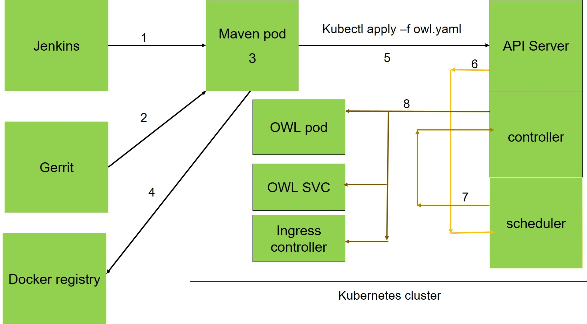

---

Here I listed the aspects about how to run k8s better.

1. [Ingress](./ingress)
   
   we use Ingress controller and individual ingress rules to expose services. 
*Kubernetes has several ways to expose the service to outside.*

   - Nodeport: as we discussed in the ```deployment/dashboard``` section, use ```Nodeport``` plus ```externalIPs```to expose the service, and this can be integreated with outside loadbalancer

   - we can also use ingres to expose the services.

     - for details about ingress, refer to [kubernetes userguide](https://kubernetes.io/docs/user-guide/ingress/) and [ingress github](https://github.com/kubernetes/ingress) and [ingress configuration](https://github.com/kubernetes/ingress/blob/master/controllers/nginx/configuration.md)

     - since we have some special demands about the ingress, we need to change the some default settings in nginx, so we create [nginx.tmpl](./ingress/nginx.tmpl), I changed the default http port to 8080 since 80 port is disabed by fault in our datacenter. 

     -  create the configmap for it.

          ```sh
          $ kubectl create configmap nginx-template --from-file=nginx.tmpl=./ingress/nginx.tmpl
          ```

     - create [default-backend](./ingress/default-backend.yaml) for ingress controller.

         ```sh
         $ kubecte create -f default-backend.yaml
         ```
     - create [ingress controller](./ingress/nginx-ingress-controller.yaml)

         ```sh
         $ kubectl create -f nginx-ingress-controller.yaml
         ```
		 **since ingress controller will watch all namespaces, so we can deploy ingress controller and backend service in any namespces, it will listen other namespaces's requests**
     - create [dashboard ingress](./ingress/dashboard-ingress.yaml)

         ```yaml
         $ kubectl create -f dashboard-ingress.yaml
         ```

     - basic authentication 
        
        - create auth configmap

            ```sh
            htpasswd -b -c  auth  admin kubernetes
            kubectl create secret generic dashboard-basic-auth --from-file=auth  -n kube-system
            ```
        
        -  modify the ingress rules  and add 
            
            ```yaml
            metadata:
             name: kubernetes-dashboard-ingress
             namespace: kube-system
             annotations:
                ingress.kubernetes.io/auth-type: "basic"
                ingress.kubernetes.io/auth-secret: "dashboard-basic-auth"
                ingress.kubernetes.io/auth-realm: "Authentication Required, please inpurt user and password"
            ```
            
            now we have to input user and password to get into the dashboard
    now we can access dashboard via ```http://kube-master/```

      - add ssl for the application.
          - create a priviate key using openssl

             ```sh
             # openssl genrsa -out app-key.pem 2048
             ```

          - modify [openssl.conf](./ssl/openssl.conf), under ```[alt_names]``` replace the ```IP``` and ```DNS``` for the service

             ```conf
             [req]
             req_extensions = v3_req
             distinguished_name = req_distinguished_name
             [req_distinguished_name]
             [ v3_req ]
             basicConstraints = CA:FALSE
             keyUsage = nonRepudiation, digitalSignature, keyEncipherment
             subjectAltName = @alt_names
             [ v3_ca ]
             subjectAltName = @alternate_names
             [alt_names]
             DNS.1=kube-master.example.com
             ```
          - create the sign request,replace the valube of ```-subj ``` with your own, which must be a *FQDN* DNS name.

             ```sh
             # openssl req -new -key app-key.pem -out app.csr  -subj "/CN=kube-master.example.com" -onfig openssl.conf
             ```


          -  copy the content of ```app.csr```, and paste it to [https://getcerts.wdf.global.corp.sap/pgwy/request/sapnetca_base64.html](https://getcerts.wdf.global.corp.sap/pgwy/request/sapnetca_base64.html) to get the certificate.

          -  copy the content of the certificate and save to app-cert.pem

          - create secret for this cert and key.       
            
            ```sh
            kubectl create secret tls kube-master-secret --key app-key.pem --cert app-cert.pem
            ```
          - modify ingress, add tls setting, then issue ```kubectl apply -f dashboard-ingress.yaml```to apply the changes.
                
            ```yaml
            apiVersion: extensions/v1beta1
            kind: Ingress
            metadata:
             name: kubernetes-dashboard-ingress
            spec:
             tls:
              - hosts:
                - kube-master.example.com
                secretName: kube-master-secret
             rules:
               - host: kube-master.example.com
                 http:
                   paths:
                     - path: /
                       backend:
                         serviceName: kubernetes-dashboard
                         servicePort: 80
                                          
2. CI/CD integration

    we use jenkins to triger CI/CD jobs, now we have depoyed two kinds of jenkins instances in our environment, with super privilege, because it will utilize docker service on the hosts. 
    Jenkins jobs will be excuting inside these PODs, buiding docker images leveraging host docker service , then pushed to our priviate docker registry.  at the same time CD jobs will be trigered which use ```kubectl apply -f pod.ymal```to create the deployment/pod/replica/svc/ingress rules. 
    examples of the jenkins pod are listed in [jenkins](./jenkins). A workflow of this intregration is 

    we still have another things to do:
      - [ ] configure host docker service, which can be running under normal users but not root user;
      - [x] configure host docker service , which can accept the request from tcp socket, not only unix socket; maven/nodejs pod can build images via connecting host docker service through tcp socket.
      - [x] running the jenkins in non-previleged way, which is more secure;
      - [ ] use ingress to expose the jenkins services.

3. Persistent Volume
    
    Types of Persistent volume:
      - static: each PV and PVC should be created before it is used in the pod, and the restrict it one pv can only be bound to one pvc. 
      - dynamic: create storageclass to host the backend storages, then each pvc can claim its storage volumes from the storageclass; thus we only need to create the storageclass and it can be used mulitple times when multiple pvc is created. 

    we still have enough flexible choices to serve the backend storages, we don't have cloud storage service, and it is also expensive to build a openstack cinder or gluster or ceph cluster which need at least 2-3 nodes. we only have one choice *NFS*. luckily I found a incubate project [nfs-provisioner](https://github.com/kubernetes-incubator/nfs-provisioner) which can meet our need, now it is moved to [external-storage](https://github.com/kubernetes-incubator/external-storage). 
      
    3.1 use nfs-provisioner to create nfs service, which use hostpath as its volume; then nfs-provisioner will be used as the backend of storageclass.
				here we use StatefulSet to host the nfs service as suggested. here is the example [nfs-provisoner](./nfs-provisioner/nfs-provisoner.yaml);

  	3.2 Create storageClass;
				
    3.3 we have two ways to use storagesClass.

      - create pvc first, then use it inside pod, examples [mysql1](./nfs-provisioner/mysql1.yaml) and [pgsql1](./nfs-provisioner/pg1.yaml); one shortage: it is not easy to scale ; this can be used in statefulset and pod(stateless);
      - instead of creating pvc, use volumeClaimTemplates ,exapmles [mysql2](./nfs-provisioner/mysql2.yaml) and [pgsql2](./nfs-provisioner/pg2.yaml); when scale, it will create new pod and new pvc. another advantage is when delete this statefulset, it will not delete the pvc; this only applicable in statefulset. 


     ***when pv is bound to pvc, thus once pvc is deleted, pv is deleted and all data on that pv is lost.***
              

4. Auto-deploy option
		
	As we describe ealier, use CI/CD to trigger the deployment is one option, here I listed two more options.
      - static pods started by kubelet service, kubelet service will scan the directory ```--pod-manifest-path``` to start them.
      - another one  which is inspired by the kubernetes official addon-manager, I created app-manager. it use fswatch to watch the directory, create new kubernete resources once new changes detected. 

    we use  [Dockerfile](./app-manager/Dockerfile) to create the docker images which includes [app-manager.sh](./app-manager/app-manager.sh) and optional [kubeconfig](./app-manager/kubeconfig)

5. supervisor
    
    when we want to running more than one application, we choose to use supervisor to handle them, as example [supervisor example](https://docs.docker.com/engine/admin/using_supervisord/).

    example ```/etc/supervisor/supervisord.conf```

    ```conf
    [unix_http_server]
    file=/var/run/supervisor.sock   ; (the path to the socket file)

    [supervisord]
    logfile=/var/log/supervisor/supervisord.log;
    pidfile=/var/run/supervisord.pid;
    childlogdir=/var/log/supervisor;
    loglevel=debug
    nodaemon=true               ; (start in foreground if true;default false)

    [program:app1]
    command=app1
    autorestart=true
    redirect_stderr=true
    stdout_logfile=/dev/stdout

    [program:app2]
    command=app2
    autorestart=true
    redirect_stderr=true
	  stdout_logfile=/dev/stdout

    ```
6. ELK
   
   We usually use ELK suite to analyze the logs, here we deploy it to view and summarize the docker container logs

   6.1 first to deploy fluentd agent via [fluentd.yaml](./ELK/fluentd.yaml) on each node to fetch all logs and send to elasticsearch server/cluster, so we use daemonset to run this agent.

   6.2 create the configmap via [elasticsearch.configmap](./ELK/elasticsearch.configmap) which contains all configurations used in elastic. this configmap contains two config files ```elasticsearch.yml``` and ```log4j2.properties```; in ```elasticsearch.yml```, I added two more parameters  ```http.cors.enabled: true``` and ```http.cors.allow-origin: "*"```, thus grafana can also get the logs from elasticsearch service.  

    6.3 create elasticsearch via [elasticsearch-deployment.yaml](./ELK/elasticsearch-deployment.yaml);in this deployment, I also used storageclass to provide persistent storage for elasticsearch data. to get indices, using ```curl -X GET 'http://{ELASTICSEARCH_HOST}:{PORT}/_cat/indices?v&pretty'```

    6.4 create kibana webui via [kibana.yaml](./ELK/kibana.yaml), one thing need to take care is when creating  kibana ingress rule, we should add annotation of ```add-base-url```, the value should be same with the value of ```"KIBANA_BASE_URL"``` in elasticsearch pod env.
      - ingress rule	

      ```yaml
      annotations:
         ingress.kubernetes.io/add-base-url: "/api/v1/proxy/namespaces/default/services/kibana-logging"
      ```
      - pod definition	

      ```yaml
			env:
      - name: "ELASTICSEARCH_URL"
        value: "http://elasticsearch-logging:9200"
      - name: "KIBANA_BASE_URL"
        value: "/api/v1/proxy/namespaces/default/services/kibana-logging"
      ````

    Now we can access kibana. 

7. Monitor

   We choose prometheus to monitor the whole kubernetes infrastructure, several exporters are used to gather and send metrics to prometheus. [node-exporter](https://github.com/prometheus/node_exporter) gather node hardware and OS metrics exposed by linux kernels,  [kube-state-metrics](https://github.com/kubernetes/kube-state-metrics) is a simple service that listens to the Kubernetes API server and generates metrics about the state of the objects(node/daemonset/Deployment/Pod/ResourceQuota/ReplicaSet/ReplicationController),kubelet(cadvisor) provide resource usage and performance characteristics of containers.they gather metrics and send to prometheus, prometheus stores the metrics data while alertmanager will send out alerts based on the alert rules; finally we use grafana to display the monitor graph.

   - deploy [node-exporter](./Monitor/prometheus-node-exporter.yaml), this is a daemonset which will run on all nodes;
   - deploy [kube-state-metrics](./Monitor/kube-state-metrics.yaml);
   - begin to deploy prometheus and alertmanager service, first we will create configmaps which provide the configration for prometheus and altertmanager; then when we need to do any updates to prometheus, will just update the configmap and reload prometheus via ```curl -X POST http(s)://{prometheus-host}:{prometheus-port}/-/reload```or ```curl -X POST http(s)://{alertmanager-host}:{alertmanager-port}/-/reload```

      - configmap for [prometheus.yml](./Monitor/prometheus.configmp), one thing need to mention that if we use self-CA to sign the keys, should set ```insecure_skip_verify: true```;
      - also we need a [alertmanager-rule](./Monitor/alertmanager-rules.configmap) when configure prometheus;
      - configmap for [alertmanager.yml](./Monitor/alertmanager.configmap), configured email as the main method, one thing need to take care is *disable stmp ssl* by setting ```smtp_require_tls: false```;
      - deploy prometheus and alermanager in a single pod via [prometheus.yaml](./Monitor/prometheus.yaml);

   - deploy grafana web ui via [grafana.yaml](./Monitor/grafana.yaml);
   - configure the datasource, since we have no idea how to configure it inside the conf, so here the datasource used ***proxy*** way to configure;
   - deploy ingress rule via [mon-ingress.yaml](./Monitor/mon-ingress.yaml) to expose the services to outside;
   - import several dashboards, first is  [Kubernetes cluster monitoring (via Prometheus)](https://grafana.net/dashboards/315) , [Docker Dashboard](https://grafana.net/dashboards/179) is another one, also this one [Docker and system monitoring](https://grafana.net/dashboards/893). after import them, we need to do some adjustments to meet our needs;
  - add new prometheus/alertmanager conf and alert-rules via configuring the  respective configmap, then re-create the configmap or update the configmap, and then reload prometheus/alertmanager as decribed in preceeding  section;

8. Software upgrade
   
   usually, we want to upgrade the software to the a newer version seamlessly, two options are available
   - blue/green upgrading, when new version arrives, deploy a comletely same environment, when new environment is up, switch the loadbalancer to point to new environment.
   - rolling update, I have figured out this. few things need to consider. 
      
      - configure the stratedy of deployment spec,make it the strategy type to RollingUpdate, and configure the parameter of RollingUpdate. maxSurge means the additional pod above the default  repica, and maxUnavailable: means the max unavailabe pods; minReadySeconds: how long a new created pod will be considered availabe,this para can be used with readinessProbe.
        
        ```yaml
				
         strategy:
           type: RollingUpdate
           rollingUpdate:
             maxSurge: 1
             maxUnavailable: 1
         minReadySeconds: 5
        ```
      - Configure the livenessprobe in the container section, readinessProbe: Periodic probe of container service readiness. Container will be removed from service endpoints if the probe fails. 
        
         ```yaml
         readinessProbe:
           tcpSocket:
             port: 8080
           initialDelaySeconds: 15
         livenessProbe:
           tcpSocket:
             port: 8080
           initialDelaySeconds: 300
         ```
