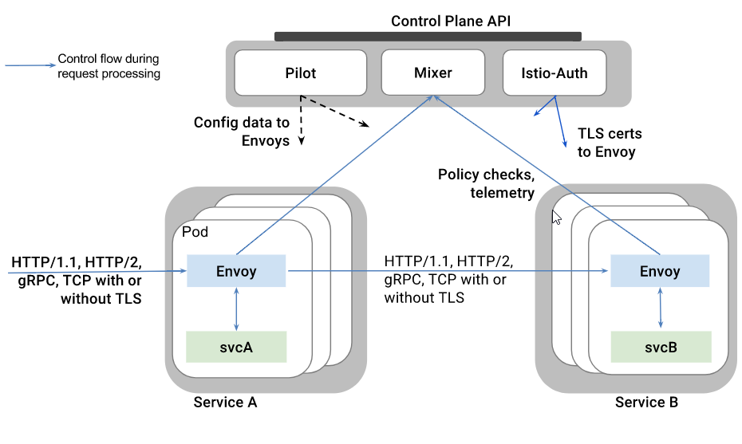
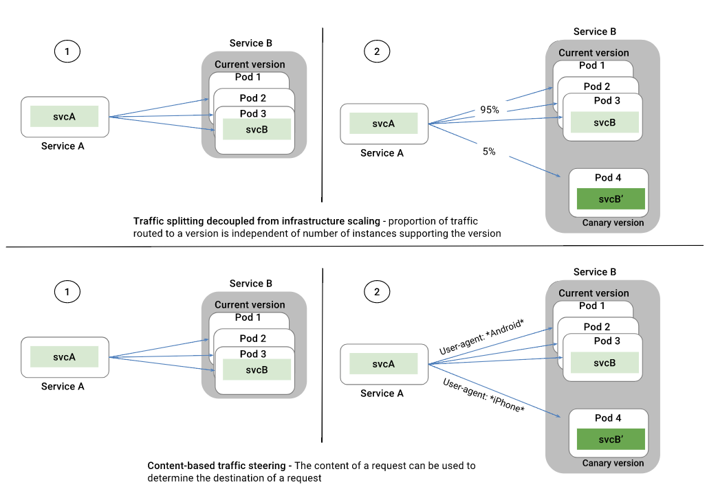
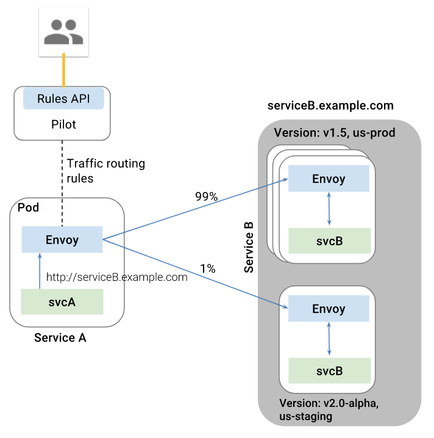
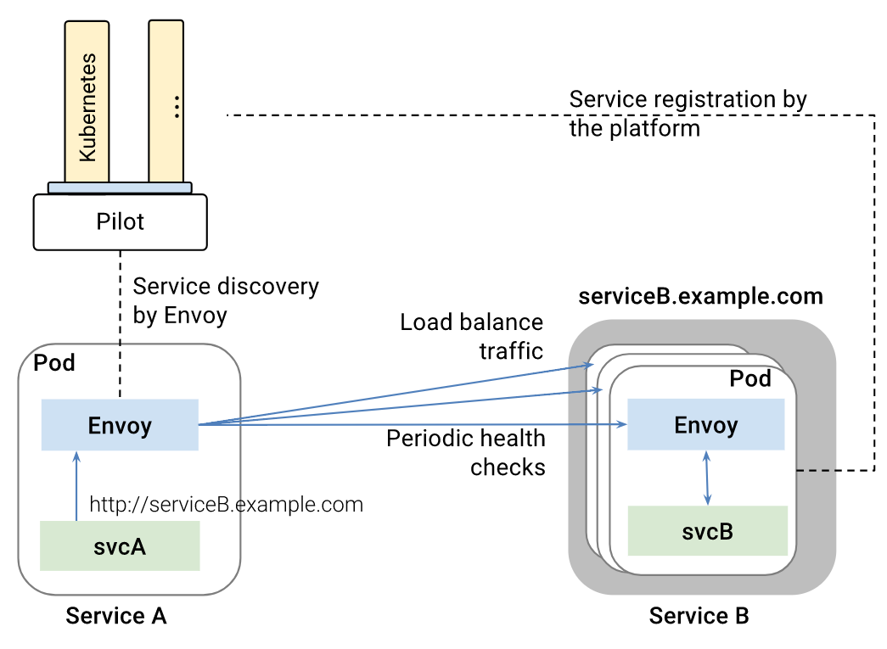

**key capabilities**：

  - **Traffic Management(Traffic Spliting)**. Control the flow of traffic and API calls between services, make calls more reliable, and make the network more robust in the face of adverse conditions. 
  
  - **Observability**. Gain understanding of the dependencies between services and the nature and  flow of traffic between them, providing the ability to quickly identify issues.
  
  - **Policy Enforcement**. Apply organizational policy to the interaction between services,  ensure   access policies are enforced and resources are fairly distributed among consumers.  Policy changes are made by configuring the mesh, not by changing application code.
  
  - **Service Identity and Security**. Provide services in the mesh with a verifiable identity and provide the ability to protect service traffic as it flows over networks of varying degrees of trustability.

  - **Visibility**. Monitoring and tracing are supported via prometheus and zipkin, without changing the code.

  - **Resiliency**. Set muliple attributes betwwen services, such as timeouts, retries, circuit breakers.

  - **Zero Code Change**: 

**Components**:

  
  - Envoy: 

    high-performance proxy developed in C++, to mediate all inbound and outbound traffic for all services in the service mesh. Envoy is deployed as a sidecar to the relevant service in the same Kubernetes pod. This allows Istio to extract a wealth of signals about traffic behavior as attributes, which in turn it can use in Mixer to enforce policy decisions, and be sent to monitoring systems to provide information about the behavior of the entire mesh
  - Mixer

    Mixer is a platform-independent component responsible for enforcing access control and usage policies across the service mesh and collecting telemetry data from the Envoy proxy and other services. The proxy extracts request level attributes, which are sent to Mixer for evaluation. More information on this attribute extraction and policy evaluation can be found in Mixer Configuration. Mixer includes a flexible plugin model enabling it to interface with a variety of host environments and infrastructure backends, abstracting the Envoy proxy and Istio-managed services from these details.

    Ues rules to determine if a service can be accessed by other services, or if it can access other  services even external services, this achieved by ingress/egress rules.
    
    - Precondition Checking. Enables callers to verify a number of preconditions before responding to an  incoming request from a service consumer. Preconditions can include whether the service consumer is  properly authenticated, is on the service’s whitelist, passes ACL checks, and more. 

    - Quota Management. Enables services to allocate and free quota on a number of dimensions. Quotas are  used as a relatively simple resource management tool to provide some fairness between service consumers when contending for limited resources. Rate limits are examples of quotas.

    - Telemetry Reporting. Enables services to report logging and monitoring. In the future, it will also enable tracing and billing streams intended for both the service operator as well as for service consumers.

  - Pilot
    

    Pilot provides service discovery for the Envoy sidecars, traffic management capabilities for intelligent routing (e.g., A/B tests, canary deployments, etc.), and resiliency (timeouts, retries, circuit breakers, etc.). we can specify what rules you want to use to route traffic between Envoy proxies and configure failure recovery features such as timeouts, retries, and circuit breakers

    - Trafic management(traffic spliting) is usefull when do Blue/Green deployment, distribute traffic to different version of same service, specify the rules that is used to route traffic between Envoy proxies.
        - Communications between services.
        - Ingress/Egress. routing traffic to external web services via the sidecar Envoy, operators can add failure recovery features such as timeouts, retries, circuit breakers, etc., and obtain detailed metrics on the connections to these services.
    - Resiliency. Configure failure recovery features such as timeouts, retries, and circuit breakers, which is called resiliency
        - Timeouts
        - Bounded retries with timeout budgets and variable jitter between retries
        - Limits on number of concurrent connections and requests to upstream services
        - Active (periodic) health checks on each member of the load balancing pool
        - Fine-grained circuit breakers (passive health checks) – applied per instance in the load balancing pool
    - Service Discovery. It maintains a canonical model of all the services in the mesh that is independent of the underlying platform and uses this to let Envoys know about the other instances in the mesh via its discovery service.Pilot exposes APIs for service discovery, dynamic updates to load balancing pools and routing tables.
        - Service registration: Platforms such as Kubernetes, Mesos already provide such functionality  for container-based applications. A plethora of solutions exist for VM-based applications.
        - Service Discovery: Pilot consumes information from the service registry and provides a platform-agnostic service discovery interface. Envoy instances in the mesh perform service discovery and dynamically update their load balancing pools accordingly.

  - Istio-Auth

    Istio-Auth provides strong service-to-service and end-user authentication using mutual TLS, with built-in identity and credential management. It can be used to upgrade unencrypted traffic in the service mesh, and provides operators the ability to enforce policy based on service identity rather than network controls. Future releases of Istio will add fine-grained access control and auditing to control and monitor who accesses your service, API, or resource, using a variety of access control mechanisms, including attribute and role-based access control as well as authorization hooks.

    provide authentication between services and end-users, and all the connections are encrypted.

    - Providing each service with a strong identity that represents its role to enable interoperability   - across clusters and clouds
    - Securing service to service communication and end-user to service communication
    - Providing a key management system to automate key and certificate generation, distribution, rotation, and revocation